 

**Software Engineering @ NUST** &nbsp;·&nbsp; **Associate Software Engineer @ ZAM Studios** &nbsp;·&nbsp; **2x AI hackathon winner**

## Stack
 
<table>
<tr>
<td width="150"><b>Agents & LLMs</b></td>
<td>
 
LangGraph · MCP · Pydantic AI · RAG · Tool calling · Structured outputs · Guardrails · Anthropic · Gemini · Mistral · Bedrock
</td>
</tr>
<tr>
<td><b>Retrieval & Eval</b></td>
<td>
FAISS · Chroma · Qdrant · Pinecone · Reranking · DeepEval · LangSmith · Observability
</td>
</tr>
<tr>
<td><b>ML & Data</b></td>
<td>
 
XGBoost · CatBoost · LightGBM · Transformers · CNN / LSTM
</td>
</tr>
<tr>
<td><b>Backend & Cloud</b></td>
<td>
 
Async Python · REST · Pydantic · Pytest · CI/CD
</td>
</tr>
<tr>
<td><b>Mobile</b></td>
<td>
 
Riverpod · Firestore · FCM · PostGIS · Google Maps SDK
</td>
</tr>
<tr>
<td><b>Languages</b></td>
<td>
&nbsp;plus SQL
</td>
</tr>
</table>
 

## How I build

| | |
|---|---|
| **Bound every loop** | Iteration caps, timeouts, and clear stop conditions. |
| **Model the state** | If a workflow matters, it lives in explicit state, not in the prompt. |
| **LLMs decide, code executes** | Models classify, plan, and select. Deterministic code validates, runs, and recovers. |
| **Plan for failure** | Retries with backoff, fallbacks, and schema validation for 429s, timeouts, and malformed JSON. |
| **Measure the system** | Routing accuracy, retrieval quality, groundedness, latency, and cost, not one good answer. |

 

AI systems, not AI demos.

